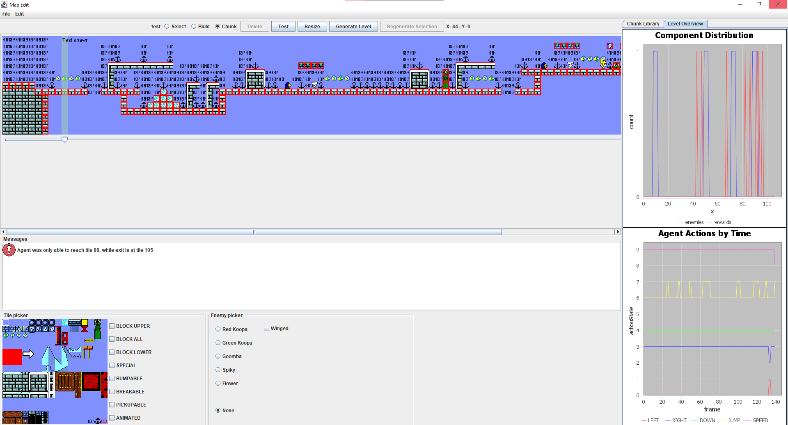
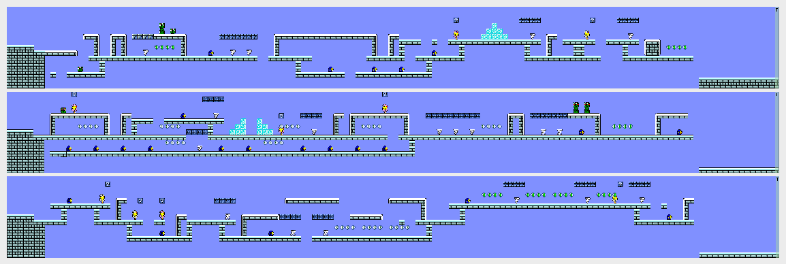

# Collaborative Procedural Content Generation for 2D Platformer Game Levels

This was a project that I wrote for 3 credits in my final year. I wanted to explore a topic related to game design,
and I was already somewhat familiar with procedural generation. I decided to research what it would take to create a 
tool that could help people creating 2D platformer levels brainstorm ideas. I was inspired by what I had read in my
research about two content generators in particular: [occupancy-regulated extension (ORE)](https://ieeexplore.ieee.org/abstract/document/5593333/) 
and [reactive grammars](https://ieeexplore.ieee.org/abstract/document/5593333/).

I decided that I would implement a level generator that would participate in the level generation process along with the level designer.
In particular, the system I created takes minor "chunks" of levels that the design feeds it, and much like ORE, it combines them in an
overlapping manner to create a level. In doing so, it helps to generate ideas for the level designer. The designer is free to edit areas
themselves afterwards, as well as select areas for regeneration. Currently, there is no mechanism to pin features of an area to be free
from level generator manipulation.

This work modified code orininally written by Notch for InfiniteTux, by Robin Baumgarten, and by the creators of the Mario AI competition.
Relevant links to the work area listed below:

- [InfiniteTux](https://github.com/qbancoffee/infinite-tux)
- [Robin Baumgarten's A* Agent](https://github.com/RobinB/mario-astar-robinbaumgarten)
- [Mario AI Competition Code](https://github.com/rictic/Mario-AI-Competition-2009)

I address the issue of playability in talking about level generation. The designer has to ensure that a level is beatable,
or otherwise they need to change it. This level generator incorporates a level playing agent from the Mario AI competition,
which can help to identify problem areas. However, its judgement is not perfect, as it does not haev perfect lookahead.

One of the goals was to create a level generator that created more diverse levels in InfiniteTux than Notch's generator, and
I used an image algorithm to analyze difference in tile patterns among the two levels. The level generator I created made
more diverse levels for 2x2 and 6x6 feature sizes, but not for 4x4. 

If I were to extend the project, I would have tried a different level generation algorithm such as wavefront collapse, or I would have
made the participation on the part of the level generator more meaningful. Perhaps it would be able to understand more context about the
level, like "this is a hard jump" or "this combination of enemies can be easily jumped over, consider adding an additional challenge."

# Extras

## More Screenshots

## Project paper (~45 pages)
[A4](bmcfadden_cosc4086_project_a4.pdf), [A5](bmcfadden_cosc4086_project_a5.pdf)

## Project presentation (~30 slides)
[pcg_platformer.pptx](pcg_platformer.pptx)

